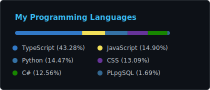
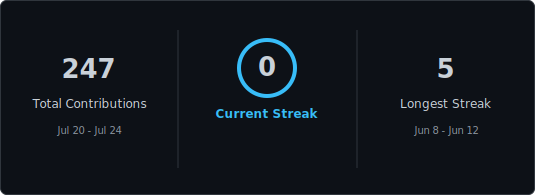

<h3>💻 Software Engineering Student | 🚀 Junior Developer | 🤖 Tech & IA</h3>

  

  

## <picture> </picture> Sobre mí / About Me 

### 🇪🇸 Español

* 👋 Hola, soy **Jork Lucas**
* 🎓 Estudiante de **Ingeniería de Software** en la **ULEAM de Manta, Ecuador**
* 📚 Actualmente curso **5to semestre**
* 💻 Soy **Programador Junior**
* 🧠 Me interesa el desarrollo de software, la inteligencia artificial y las nuevas tecnologías
* 🚀 Me gusta crear proyectos útiles, resolver problemas y seguir aprendiendo constantemente

### 🇬🇧 English

* 👋 Hi, I'm **Jork Lucas**
* 🎓 **Software Engineering** student at **ULEAM, Manta - Ecuador**
* 📚 Currently in my **5th semester**
* 💻 **Junior Developer**
* 🧠 Interested in software development, artificial intelligence and modern technologies
* 🚀 I enjoy building useful projects, solving problems and learning every day

---

## 🛠️ Tech Arsenal

<table width="72%">
  <tr>
    <td align="center" width="50%">
      <b>Frontend</b>  

</td>

<td align="center" width="50%">
  <b>Backend & Data</b>  

</td>
</tr>

<tr>
<td align="center" colspan="2">
   <b>Tools & Cloud</b>  

</td>
</tr>
</table>

  

## 🤖 AI Agents & Tools

  Herramientas que uso para aprender, programar, generar ideas, construir soluciones y mejorar mis proyectos con inteligencia artificial.

---

## 🚀 Featured Projects

<table>
<tr>
<td width="50%">

<h3 align="center">🏥 CareGuide-AI</h3>

  <b>Proyecto HealthTech desarrollado durante la HackIAthon organizada por Viamática en Guayaquil.</b>

CareGuide-AI es una solución enfocada en el área de salud, diseñada para ayudar al paciente a entender mejor su atención médica antes de atenderse.

El proyecto funciona como un estimador agéntico de copago y cobertura: el paciente ingresa su síntoma, el agente sugiere la especialidad médica, cruza datos con el plan de seguro y orienta sobre el copago, la cobertura y la opción más conveniente.

  
  
  

</td>
<td width="50%">

<h3 align="center">🔎 FraudIA Claims</h3>

  <b>Copiloto de IA para detectar posibles fraudes en siniestros.</b>

Proyecto desarrollado para el reto de <b>Aseguradora del Sur</b>, enfocado en detectar posibles fraudes en siniestros usando inteligencia artificial.

La solución analiza información del siniestro y genera alertas de revisión para apoyar la toma de decisiones, sin realizar acusaciones automáticas de fraude.

Este reto formó parte de la HackIAthon y nos ayudó a llegar a los <b>18 finalistas</b>.

  
  
  
  

</td>
</tr>
</table>

---

## 📊 GitHub Analytics

<table>
  <tr>
    <td>
      
    </td>
    <td>
      
    </td>
  </tr>
</table>

  

## 📈 Contribution Graph

---

---

## 🌐 Connect With Me

            
 

  

  

<h3>
</h3>
<a href="https://open.spotify.com/user/jdlucas12">
  
  
---

</a>

<h3>✨ Gracias por visitar mi perfil ✨</h3>

  <b><code>Thanks for visiting my profile 👋</code></b>

